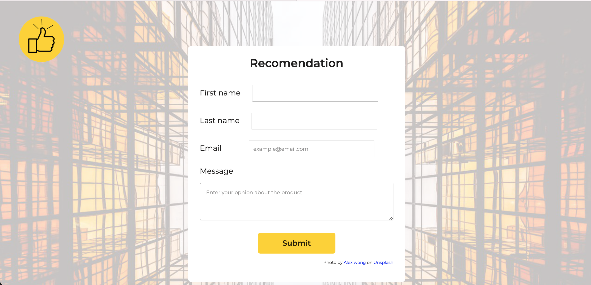
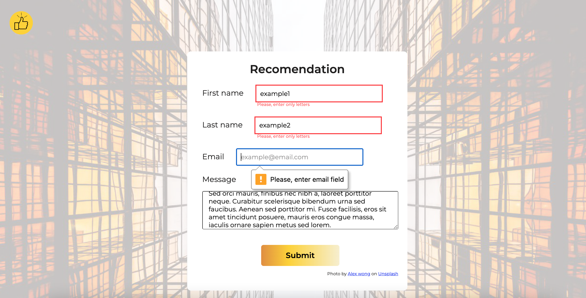
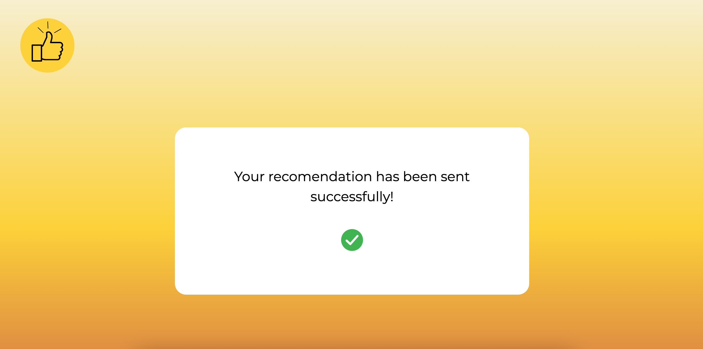
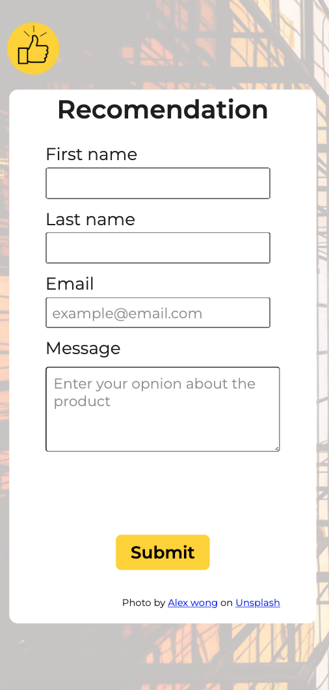

# Thumbs-up 

## A Product Recomendation Form

Thumbs-up is a short product recomendation form that allows you to write a product review. The input fields are validated using "regex" and the method match(). Once the form is validated and sent, it displays a confirmation that the review was sent successfully. 

The intention of this projected was to test my skills in HTML, CSS and JS.

  

## How to use it

**1.** Enter your name and surname information. Pay attention to add only letters. In case you type a number, a mensagem will apear in red color informing you to add only letters; 
**2.** Add your email address. There will be an automatic validation of this field. Please inform a valid email address; 
**3.** Write your opinion about the product, hit the button submit and wait to see the confirmation.

## Go mobile

Thumbs-up layout style was also designed to support mobile.

  

Check it live: https://thumbsup.netlify.app

## Projet's Structure

>Conceptual design of the website and project 
>Creation of the logo using Canva.com 
>Designing the website structure using Figma 
>Adding logo, labels and input field in a coherent HTML structure 
>Applying the style to the main page 
>Working in creating the validation for the fields 
>Creating a diferent html page for recomendation sent confirmation 
>Applying and recycling a diferent style for the confirmation page 
>Adding button functionality 
>Bringing the website live, using Netlify 
